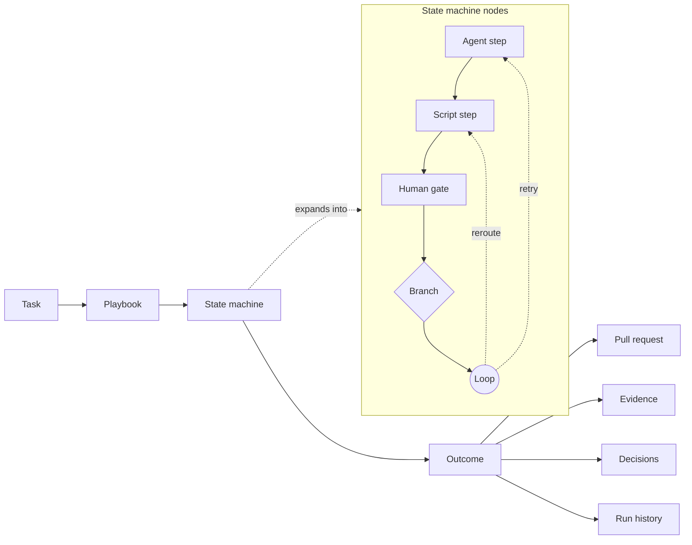

<div align="center">

# @revisium/orchestrator

Local-first orchestration for software-development work driven by short-lived agents.

**Turn a task into a playbook-driven state machine.**

[](LICENSE)
[](https://github.com/revisium/orchestrator/actions/workflows/ci.yml)
[](https://sonarcloud.io/summary/new_code?id=revisium_agent-orchestrator)
[](https://www.npmjs.com/package/@revisium/orchestrator)

Part of the [Revisium](https://github.com/revisium/revisium) ecosystem.

</div>



> Revo is in active development. The package is suitable for evaluation and local experimentation; do not treat
> the public contract as stable yet.

## Overview

Revo is a local control plane for agentic work. A caller creates a run, Revo selects a playbook, and the playbook
executes as a state machine made of agent steps, script steps, human gates, branches, and loops.

The goal is not to replace coding agents. Revo coordinates them: it keeps state, records evidence, enforces gates,
and gives humans a stable place to approve plans, resolve questions, inspect feedback, and decide when work is ready
to ship.

## How It Works

- **Playbooks define flow.** Roles, scripts, gates, verdicts, branches, and loop limits are data, not hidden prompt
  convention.
- **Agent steps are short-lived.** Each agent process receives current state and exits after one step.
- **Script steps do deterministic work.** Automation such as integration, polling, and response actions stays outside
  agent prompts.
- **Human gates are state changes.** A plan approval, question answer, or merge approval resolves an inbox item and
  resumes the run.
- **Outputs are traceable.** Artifacts, evidence, decisions, attempts, cost, and run history are recorded for later
  inspection.

## Concepts

| Term | Meaning |
| --- | --- |
| **Revo** | The local orchestrator and control plane for software-development runs. |
| **Playbook** | A versioned bundle of roles, pipelines, policies, and routing rules. |
| **Pipeline** | A state-machine template that defines the steps, gates, branches, loops, and terminal outcomes. |
| **Role** | A named agent definition: prompt, model level, scope, runner, and allowed behavior. |
| **Agent step** | A pipeline node that starts a short-lived coding agent through a role. |
| **Script step** | A deterministic automation node used for integration, polling, readiness, or response actions. |
| **Human gate** | A required decision or answer; the run parks until an inbox item is resolved. |
| **Run** | One task moving through a selected playbook and pipeline. |
| **Attempt** | One execution of one step; the unit for logs, verdicts, tokens, and cost. |
| **MCP** | The local agent-facing tool bridge exposed by `revo mcp`. |
| **GraphQL API** | The local API surface for UI and script integrations. |

## Alpha Install

The `@alpha` package is a prerelease for evaluating Revo locally. It uses the `default` profile:

```sh
npm install -g @revisium/orchestrator@alpha
revo start
revo status
revo doctor
revo logs
revo stop
```

Connect an MCP-capable agent to the installed binary:

```sh
codex mcp add revo -- revo mcp
claude mcp add revo -- revo mcp
```

Default local ports:

| Service | Port |
| --- | --- |
| Revisium standalone HTTP | `19222` |
| embedded Postgres | `15440` |
| Revo GraphQL | `19223` |

GraphQL is available at `http://127.0.0.1:19223/graphql` in the default profile. The target contract is documented in
[docs/specs/graphql-admin-api-v1.spec.md](./docs/specs/graphql-admin-api-v1.spec.md), and the committed SDL is
[src/api/graphql-api/schema.graphql](./src/api/graphql-api/schema.graphql).

## Roadmap

Revo is in active development. The public roadmap lives in GitHub Milestones and umbrella issues; this README only points to the current tracks.

| Track | Start here |
| --- | --- |
| Default playbook stabilization | [Milestone #1](https://github.com/revisium/orchestrator/milestone/1), [umbrella #146](https://github.com/revisium/orchestrator/issues/146) |
| GraphQL admin API v1 migration | [Milestone #4](https://github.com/revisium/orchestrator/milestone/4), [umbrella #167](https://github.com/revisium/orchestrator/issues/167) |
| Execution profiles and runner/model binding | [Milestone #5](https://github.com/revisium/orchestrator/milestone/5), [umbrella #168](https://github.com/revisium/orchestrator/issues/168) |
| Loop engineering layer | [Milestone #2](https://github.com/revisium/orchestrator/milestone/2), [umbrella #148](https://github.com/revisium/orchestrator/issues/148) |
| Role and pipeline authoring | [Milestone #3](https://github.com/revisium/orchestrator/milestone/3), [umbrella #157](https://github.com/revisium/orchestrator/issues/157) |

Use umbrella issues for initiative context and child issues for reviewable delivery slices. Work orders do not live in docs.

## Local Development

Use the `dev` profile when running a source checkout next to an installed package. The profile has isolated ports,
data directory, and DBOS database.

```sh
pnpm install
pnpm run revo -- start --profile dev
pnpm run revo -- status --profile dev
pnpm run revo -- doctor --profile dev
pnpm run revo -- logs --profile dev
pnpm run revo -- stop --profile dev
```

| Knob | `default` | `dev` |
| --- | --- | --- |
| data dir | `~/.revisium-orchestrator` | `~/.revisium-orchestrator-dev` |
| standalone HTTP / Postgres | `19222` / `15440` | `19622` / `15840` |
| Revo GraphQL | `19223` | `19623` |
| DBOS database | `dbos` | `dbos_dev` |

Explicit environment variables override the profile: `REVO_DATA_DIR`, `REVO_PORT`, `REVO_PG_PORT`,
`REVO_GRAPHQL_PORT`, and `REVO_DBOS_DB`.

## Front Doors

`revo mcp` is the agent front door. It is a local stdio bridge to the daemon and exposes product-level tools for
runs, gates, repository diagnostics, method discovery, and PR readiness.

```sh
codex mcp add --env REVO_PROFILE=dev revo-dev -- pnpm --dir /abs/path/to/orchestrator run revo -- mcp
claude mcp add -e REVO_PROFILE=dev revo-dev -- pnpm --dir /abs/path/to/orchestrator run revo -- mcp
```

For the `dev` profile, GraphQL is available at `http://127.0.0.1:19623/graphql`.

## Verification

```sh
pnpm run typecheck
pnpm run lint:ci
pnpm run test:cov
pnpm run verify
```

Smoke and e2e scripts that start local daemons may need an unsandboxed terminal and isolated non-default ports.

## Documentation

| Start here | Purpose |
| --- | --- |
| [docs/README.md](./docs/README.md) | Documentation map and ownership rules |
| [docs/vision.md](./docs/vision.md) | Product direction, glossary, and capability map |
| [docs/architecture-overview.md](./docs/architecture-overview.md) | Runtime layers, invariants, and lifecycle |
| [docs/developer-guide.md](./docs/developer-guide.md) | Source map and contributor onboarding |
| [docs/specs/](./docs/specs/) | Exact product contracts |
| [docs/adr/](./docs/adr/) | Durable architecture decisions |
| [AGENTS.md](./AGENTS.md) | Repo-local instructions for coding agents |

## License

MIT - see [LICENSE](./LICENSE).
