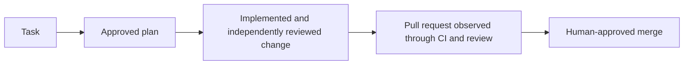

<div align="center">

# @revisium/orchestrator

Deterministic, durable, local control over software-development work performed by short-lived AI agents.

**Turn a task into a reviewed change without giving the model control of the process.**

[](LICENSE)
[](https://github.com/revisium/orchestrator/actions/workflows/ci.yml)
[](https://sonarcloud.io/summary/new_code?id=revisium_agent-orchestrator)
[](https://www.npmjs.com/package/@revisium/orchestrator)

Part of the [Revisium](https://github.com/revisium/revisium) ecosystem.

</div>


```mermaid
flowchart LR
  task[Task]
  plan[Approved plan]
  change[Implemented and independently reviewed change]
  pr[Pull request observed through CI and review]
  merge[Human-approved merge]

  task --> plan --> change --> pr --> merge
```

> Revo is in active development. The package is suitable for evaluation and local experimentation; do not treat
> the public contract as stable yet.

## Overview

Revo is a deterministic, durable, local control plane over probabilistic AI workers. LLMs may understand, propose,
and execute work, but algorithms and humans retain authority over state transitions, budgets, gates, permissions,
and irreversible actions.

The first product wedge is deliberately narrow: task or issue -> approved plan -> implemented and independently
reviewed change -> pull request observed through CI and review feedback -> human-approved merge. Revo coordinates
coding agents around that loop; it does not replace them or trust them to govern it.

## How It Works

- **A pure reducer owns routing.** `pipeline-core` consumes a pinned graph, state, and recorded result, then emits one
  decision. It performs no I/O and does not delegate cursor control to an agent or script.
- **Durability stays outside the reducer.** DBOS owns workflow progress, waits, retries, checkpointing, and recovery.
- **Agents are untrusted, short-lived workers.** Each process receives one bounded task, returns a typed result, and
  exits. It cannot advance the cursor, bypass a gate, mutate policy, or publish outside the selected graph.
- **Scripts are bounded effects.** Git, GitHub, filesystem, and network operations depend on external state. The
  deterministic part is the transition over their validated, recorded result, not the external outcome itself.
- **Humans retain irreversible authority.** Inbox-backed gates park the run until the declared approval or answer is
  recorded. A changed approval subject must be reviewed again.
- **Storage has explicit owners.** DBOS owns progress; Revo Prisma owns hot runtime facts; the embedded Revisium
  engine owns committed/versioned meaning; Git, worktrees, and files own source changes and large artifacts.
- **Front doors share application services.** MCP serves agents and GraphQL serves UI/scripts, but neither transport
  owns orchestration or reads storage internals directly.

## Contract Status

- **Current shipped behavior:** the pure pipeline reducer, DBOS adapter, Prisma runtime rows, versioned control-plane
  rows, human gates, agent runners, product-owned script handlers, and the built-in executable default graph.
- **Accepted target:** the generic pipeline-as-data engine and graph-shaped GraphQL direction recorded by Accepted
  ADRs. Some GraphQL compatibility roots remain during implementation.
- **Draft target:** validate an executable authoring package into an immutable `PlaybookVersion`, resolve a complete
  per-run `ExecutionPlan`, and execute versioned script/effect and resource/workspace contracts without live mutable
  registry reads. See the Draft specs in [docs/specs/](./docs/specs/).
- **Later:** reusable graph fragments, trusted build/install-time custom scripts, broader ADR/KB workflows, and richer
  UI. These extend the first wedge; they are not prerequisites for it.

## Concepts

| Term | Meaning |
| --- | --- |
| **Revo** | The local orchestrator and control plane for software-development runs. |
| **Playbook** | A versioned method package. Today Revo ships a product-owned executable bootstrap graph; the full canonical package-to-`PlaybookVersion` path is Draft. |
| **Pipeline** | A validated state-machine graph that defines steps, gates, branches, loops, and terminal outcomes. |
| **Role** | A named agent definition: prompt, model level, scope, runner, and allowed behavior. |
| **Agent step** | A pipeline node that starts a short-lived coding agent through a role. |
| **Script/effect step** | A bounded operation that returns a typed recorded result. External effects are not deterministic outcomes and do not choose the next node. |
| **Human gate** | A required decision or answer; the run parks until an inbox item is resolved. |
| **Run** | One task moving through a selected playbook and pipeline. |
| **Execution plan** | Draft target: the immutable, fully resolved execution-affecting inputs pinned for one run. |
| **Attempt** | One execution of one step; the unit for logs, verdicts, tokens, and cost. |
| **MCP** | The local agent-facing tool bridge exposed by `revo mcp`. |
| **GraphQL API** | The local API surface for UI and script integrations. |

## Alpha Install

The `@alpha` package is a prerelease for evaluating Revo locally. It uses the `default` profile:

```sh
npm install -g @revisium/orchestrator@alpha
revo start
revo status
revo doctor
revo logs
revo stop
```

Connect an MCP-capable agent to the installed binary:

```sh
codex mcp add revo -- revo mcp
claude mcp add revo -- revo mcp
```

Default local ports:

| Service | Port |
| --- | --- |
| Revo base port | `19222` |
| embedded Postgres | `15440` |
| Revo GraphQL | `19223` |

GraphQL is available at `http://127.0.0.1:19223/graphql` in the default profile. The target contract is documented in
[docs/specs/graphql-admin-api-v1.spec.md](./docs/specs/graphql-admin-api-v1.spec.md), and the committed SDL is
[src/api/graphql-api/schema.graphql](./src/api/graphql-api/schema.graphql).

## Roadmap

Revo is in active development. The public roadmap lives in GitHub Milestones and umbrella issues; this README only points to the current tracks.

| Track | Start here |
| --- | --- |
| Default playbook stabilization | [Milestone #1](https://github.com/revisium/orchestrator/milestone/1), [umbrella #146](https://github.com/revisium/orchestrator/issues/146) |
| GraphQL admin API v1 migration | [Milestone #4](https://github.com/revisium/orchestrator/milestone/4), [umbrella #167](https://github.com/revisium/orchestrator/issues/167) |
| Run profiles and runner/model binding | [Milestone #5](https://github.com/revisium/orchestrator/milestone/5), [umbrella #168](https://github.com/revisium/orchestrator/issues/168) |
| Loop engineering layer | [Milestone #2](https://github.com/revisium/orchestrator/milestone/2), [umbrella #148](https://github.com/revisium/orchestrator/issues/148) |
| Role and pipeline authoring | [Milestone #3](https://github.com/revisium/orchestrator/milestone/3), [umbrella #157](https://github.com/revisium/orchestrator/issues/157) |

Use umbrella issues for initiative context and child issues for reviewable delivery slices. Work orders do not live in docs.

## Local Development

Use the `dev` profile when running a source checkout next to an installed package. The profile has isolated ports,
data directory, and DBOS database.

```sh
pnpm install
pnpm run build
pnpm run revo -- start --profile dev
pnpm run revo -- status --profile dev
pnpm run revo -- doctor --profile dev
pnpm run revo -- logs --profile dev
pnpm run revo -- stop --profile dev
```

| Knob | `default` | `dev` |
| --- | --- | --- |
| data dir | `~/.revo` | `~/.revo-dev` |
| Revo base / Postgres | `19222` / `15440` | `19622` / `15840` |
| Revo GraphQL | `19223` | `19623` |
| DBOS database | `dbos` | `dbos_dev` |

Explicit environment variables override the profile: `REVO_DATA_DIR`, `REVO_PORT`, `REVO_PG_PORT`,
`REVO_GRAPHQL_PORT`, and `REVO_DBOS_DB`.

### Build and globally install a local Revo

This workflow is for local development/testing of the CLI and MCP server, **not** for publishing a release.

**Build from the orchestrator checkout:**

```sh
pnpm install --frozen-lockfile
pnpm run build
```

**Pack a tarball** (preferred over a directory-symlink install):

```sh
npm pack --pack-destination /private/tmp
```

This emits `/private/tmp/revisium-orchestrator-0.0.0.tgz` (filename tracks `package.json` `version`).

**Identify the active Node prefix that owns the `revo` binary:**

```sh
which revo
```

Resolve the symlink and pick the prefix that contains both `bin/revo` and
`lib/node_modules/@revisium/orchestrator`. `npm prefix -g` may point to a *different* prefix than the active
`revo` binary (common under nvm), so derive the prefix from `which revo`, not from `npm prefix -g`.

**Install the tarball globally into that prefix:**

```sh
npm install -g --prefix <active-node-prefix> /private/tmp/revisium-orchestrator-0.0.0.tgz
```

For nvm installs, the active prefix is usually the parent directory that contains both `bin/revo` and
`lib/node_modules/@revisium/orchestrator`. Use that prefix consistently for both `npm` and `revo`.

> **Warning:** do not use `npm install -g <local-dir>` from a temporary worktree. npm may install a symlink to
> that directory; if the worktree is later removed, the global `revo` binary breaks. The tarball install copies
> files and avoids this.

**Restart and verify health:**

```sh
revo restart
revo status
revo doctor
```

**Verify the MCP tool surface after a global tool/schema change:**

Restart the Codex session so MCP tool schemas are reloaded. `get_capabilities` should list:
`get_run_attention`, `get_run_status`, `get_run_digest`, `get_run_events`, `get_agent_activity`,
`get_agent_log`, `watch_run_changes`. Legacy observation tools are absent from the current contract.

If Codex cannot expose `mcp__revo` tools after restart, check `~/.codex/config.toml`: use an absolute path to
the active `revo` binary, for example `command = "<active-node-prefix>/bin/revo"`, rather than
`command = "revo"` — the Codex process PATH may not include nvm.

## Front Doors

`revo mcp` is the agent front door. It is a local stdio bridge to the daemon and exposes product-level tools for
runs, gates, repository diagnostics, method discovery, and PR readiness.

For source-iteration MCP testing, point the MCP client at the `pnpm run revo` script:

```sh
codex mcp add --env REVO_PROFILE=dev revo-dev -- pnpm --dir /abs/path/to/orchestrator run revo -- mcp
claude mcp add -e REVO_PROFILE=dev revo-dev -- pnpm --dir /abs/path/to/orchestrator run revo -- mcp
```

For testing the same built entrypoint that the package uses, point the MCP client at `bin/revo.js`:

```sh
pnpm run build
REVO_PROFILE=dev ./bin/revo.js restart --profile dev
REVO_PROFILE=dev ./bin/revo.js doctor --profile dev
codex mcp add --env REVO_PROFILE=dev revo-dev -- /abs/path/to/orchestrator/bin/revo.js mcp
claude mcp add -e REVO_PROFILE=dev revo-dev -- /abs/path/to/orchestrator/bin/revo.js mcp
```

`bin/revo.js` imports `dist/cli/index.js`, so it does not see source edits until `pnpm run build` runs. After
changing MCP tools or capabilities, rebuild, restart the `dev` stack, and reconnect or restart the MCP client session
so the client refreshes its tool list. A built MCP smoke should confirm `get_capabilities.tools` contains
`get_run_attention`, `get_run_status`, and `watch_run_changes`, with no legacy observation tools.

For the `dev` profile, GraphQL is available at `http://127.0.0.1:19623/graphql`.

## Verification

```sh
pnpm run typecheck
pnpm run lint:ci
pnpm run test:cov
pnpm run verify
```

Smoke and e2e scripts that start local daemons may need an unsandboxed terminal and isolated non-default ports.

## Documentation

| Start here | Purpose |
| --- | --- |
| [docs/README.md](./docs/README.md) | Documentation map and ownership rules |
| [docs/vision.md](./docs/vision.md) | Product direction, glossary, and capability map |
| [docs/architecture-overview.md](./docs/architecture-overview.md) | Runtime layers, invariants, and lifecycle |
| [docs/developer-guide.md](./docs/developer-guide.md) | Source map and contributor onboarding |
| [docs/specs/](./docs/specs/) | Exact product contracts |
| [docs/adr/](./docs/adr/) | Durable architecture decisions |
| [AGENTS.md](./AGENTS.md) | Repo-local instructions for coding agents |

## License

MIT - see [LICENSE](./LICENSE).
