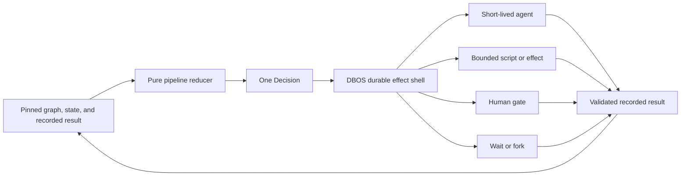
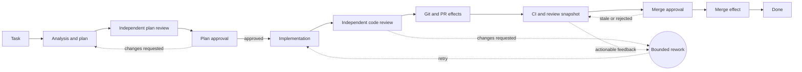

# Architecture overview

Read this before changing runtime behavior. This page owns Revo's architectural model and the boundary between
shipped behavior and proposed contracts. Exact schemas and mechanics live in [specs/](./specs/).

## Status language

- **Current shipped behavior** describes the live source and schema.
- **Accepted target** is approved by an Accepted ADR/spec, even when delivery is incomplete.
- **Draft target** is a proposed contract and must not be presented as shipped or accepted.
- **Later** is direction without a stable contract.

Implementation presence does not change an ADR status. Accepted ADRs remain immutable. Current storage truth lives in
this overview and [control-plane-schema.md](./control-plane-schema.md); Draft ADR-0007 proposes amendments to the
earlier Accepted storage wording.

## One paragraph

Revo is a deterministic, durable, local control plane over probabilistic AI workers. The current host is NestJS;
`pipeline-core` is the pure state-machine reducer; DBOS owns workflow progress, waits, retries, and recovery; Revo
Prisma owns hot product/runtime facts; the embedded Revisium engine owns committed/versioned meaning; and Git,
worktrees, and files own source changes and large artifacts. MCP and GraphQL are front doors over shared application
services. Algorithms decide transitions and humans decide declared gates; agents and external effects only return
recorded results.

## Functional core and durable effect shell



Source: [assets/revo-concept.mmd](./assets/revo-concept.mmd).

`pipeline-core` consumes only graph data, reducer state, and the last typed result. It emits exactly one decision:
invoke a role, invoke a script/effect, await a human gate, start a timer, fork work, or complete. It performs no I/O,
reads no clock or registry, and contains no GitHub lifecycle or product-pipeline node ids.

The DBOS adapter executes that decision, persists progress, records an external result, and feeds the small routing
signal back into the reducer. Durable execution does not make an LLM or a GitHub request deterministic; it makes the
transition and recovery path controlled.

## Current shipped layers

```text
[ CLI lifecycle ]        start / stop / status / restart / doctor / logs / mcp bridge
         |
[ MCP + GraphQL ]        transport mapping over shared product/application services
         |
[ NestJS host ]          run, gate, method, PR, observation, and runner services
         |
[ pipeline-core ]        pure validation, state reduction, and one-decision emission
         |
[ DBOS adapter ]         durable progress, waits, retries, checkpoint/replay, effect invocation
         |
[ execution boundary ]   short-lived agents + product-owned script handlers + human gates
```

Storage is adjacent to those layers rather than another routing engine. Product services hide Prisma and Revisium
details; the DBOS service hides workflow internals; Git/worktree adapters hide source-work mechanics.

## Current data ownership

| Owner | Current responsibility | Not its responsibility |
| --- | --- | --- |
| DBOS | Workflow progress, queues, waits, retries, checkpoint/replay | Product meaning, run projections, repository content |
| Revo Prisma | `RevoProject`, runs, tasks, attempts, inbox, events, outputs, cost ledger, route pins, indexes | Versioned control-plane meaning, DBOS tables, source diffs |
| Embedded Revisium engine | Committed/versioned playbook metadata, role/pipeline definitions, run/model profiles, routing policy; engine branch/revision/table primitives | Hot run lifecycle facts, workflow progress |
| Git/worktrees/files | Repository state, branches, worktrees, diffs, logs, and large artifacts | Routing cursor or accepted control-plane meaning |

The Revo Prisma models and engine-required physical tables share the Revo product database in the current storage
implementation. DBOS uses a separate logical database managed by its SDK. Shared physical infrastructure does not
collapse the ownership boundary.

The current Prisma schema has `RevoProject` and repository references on runs/tasks; it does not yet have a
first-class `Repository` model. Do not document a repository registry as shipped.

## Current execution source and pinning

The shipped product has two playbook-related surfaces that must not be conflated:

1. `control-plane/default-playbook/` contains the product-owned bootstrap catalogs, including executable
   `execution_policy.template_json` graphs used by current runs.
2. `@revisium/agent-playbook` is the canonical human-reviewable method package. Its current role and pipeline catalogs
   provide discovery, role sets, route gates, runner metadata, and execution-policy recommendations, but no executable
   graph. The shipped Revo importer cannot execute that package end to end.

Current run creation stores a materialized template, its hash, profile snapshot/hash, materializer/policy versions,
and resolved launch bindings in Prisma `TaskRun.routeDecision`. Recovery uses those route pins. The current pin is not
yet the complete Draft `ExecutionPlan`: not every execution-affecting playbook document, capability, resource,
script implementation, or accepted knowledge revision is resolved into one immutable object.

The built-in executable graph is bootstrap data, not a second canonical authoring source for
`@revisium/agent-playbook`.

## Current run lifecycle

1. A caller creates a run through MCP or GraphQL and selects a pipeline/profile or receives a confirmation request.
2. Product services resolve the stored pipeline/profile and persist the route decision in Prisma.
3. DBOS starts or reattaches the workflow by run id.
4. `pipeline-core` emits one decision from the pinned materialized graph and reducer state.
5. The adapter invokes a short-lived agent, a current product-owned script handler, a gate wait, a timer, a fork, or
   terminal completion.
6. The adapter validates and records outputs/events/attempt evidence, then passes the routing result back to the core.
7. A human decision resolves a Prisma inbox item and signals the parked workflow.

## Authority invariants

1. **The reducer owns transitions.** A worker result is input; it is not permission to mutate the cursor directly.
2. **Humans own declared gates.** Agents and scripts cannot approve, skip, or silently replace a gate.
3. **Policy is pinned data.** Workers cannot change budgets, iteration caps, runner permissions, or effect scope.
4. **Agents are short-lived.** Continuing a run starts a new process with selected current state, not a durable chat
   session.
5. **Storage knowledge is sealed.** MCP/GraphQL and pipeline code use application/domain services rather than raw
   Prisma, Revisium, or DBOS tables.
6. **Source work stays in source storage.** Routing state holds typed summaries and references, not repository copies
   or large diffs.
7. **Replay does not recreate external reality.** It reuses durable progress and recorded results according to the
   pinned contract; effects are idempotent where retry can repeat them.

## Agent and effect boundaries

An agent may analyze, propose, edit within its role rights, and return a typed result. It cannot advance the cursor,
change graph/policy, invoke undeclared effects, or publish outside the graph.

Current script nodes resolve named product handlers, including integration and PR lifecycle operations. Those handlers
perform real Git, GitHub, filesystem, or process I/O; their outcomes depend on external state. The deterministic claim
applies only to reducer routing over the validated recorded result.

The Draft [script runtime contract](./specs/script-runtime-v1.spec.md) separates a versioned bounded-operation
definition from each execution and pins its behavior/implementation identity, schemas, effect class, permissions,
resources, retry/timeout/idempotency policy, redaction behavior, and event contract. Exact fields remain in that spec.
A script returns a result and never selects the next node or opens a gate.

The Draft [resources, workspaces, and effects contract](./specs/resources-workspaces-effects-v1.spec.md) moves
repository/worktree creation and release into explicit resource lifecycle. It also decomposes monolithic Git/GitHub
behavior into bounded operations and makes PR polling a short snapshot followed by a pipeline-owned wait/recheck loop.

## Human gates and freshness

Current human gates are Prisma inbox rows backed by a DBOS wait. Resolving a gate records the answer and resumes the
workflow. Product-specific merge readiness/recheck behavior exists in the built-in graph and script handlers.

The Draft target gives every approval a generic subject/revision identity, such as an artifact hash or repository
head. If the subject changes after approval, the prior approval is stale and cannot authorize the new subject. The
generic adapter remains unaware of names such as `mergeGate`; the graph declares which subject a gate protects. Exact
mechanics belong to the human-gate and resources/effects specs.

## MCP, GraphQL, and UI

MCP and GraphQL may use different wire shapes, but they call the same application commands and queries and expose the
same product state. Neither transport owns orchestration, reads DBOS tables, or implements separate gate logic. A UI
is a projection/editor over those APIs, not an alternative engine.

The graph-shaped GraphQL v1 direction is an **Accepted target** under ADR-0003. Compatibility roots in the committed
SDL remain **Current shipped behavior** until the migration is complete.

## Draft playbook and execution-plan target

The proposed authority chain is:

```text
canonical authoring package
  -> installer/compiler validation and capability resolution
  -> immutable PlaybookVersion
  -> route-time fully resolved ExecutionPlan
  -> selected worktree/context materialization
  -> DBOS execution and recovery from the same pin
```

The package must declare a machine-readable executable graph. Runtime LLM parsing of pipeline Markdown is not an
execution contract. If executable graph/effect/artifact fields are added to the current authoring schema, the package
schema version changes explicitly.

The `ExecutionPlan` resolves all execution-affecting inputs, including graph, roles, runner capabilities, scripts,
policies, resources, selected context, and version/hash pins. Workflow execution and recovery do not re-read mutable
package HEAD, source checkouts, registries, or accepted-knowledge HEAD. Exact structure is owned by
[execution-plan-v1.spec.md](./specs/execution-plan-v1.spec.md).

This internal alpha redesign targets direct cutover: no legacy aliases, fallback reads, dual-write old/new models,
migration shims, hidden filesystem scanning, or public stub-vs-live product fork.

## Draft ADR and knowledge lifecycle

Playbook/method, normative project ADRs, descriptive project knowledge, and one-run evidence are different data
classes. A run-authored ADR or KB change is a proposal, not accepted meaning:

```text
run artifact
  -> proposal branch/revision
  -> validation and review
  -> human or declared policy gate
  -> accepted revision
  -> explicit pin for future runs
```

Agents read accepted revisions by default; proposal content enters context only when the selected graph asks for it.
Knowledge carries source/provenance and verification time. Search/vector indexes may be derived but do not become the
source of truth. The current Prisma `RevoProject`/engine project identity is partly implemented; ADR/KB tables,
proposal flow, and context pins remain Draft under ADR-0008 and its specs.

## Current default pipeline example

The built-in `feature-development` graph is one product flow over a generic engine. Its domain node ids and PR policy
belong to product bootstrap data, not to `pipeline-core`.



Source: [assets/default-pipeline-example.mmd](./assets/default-pipeline-example.mmd).

## Later

Reusable graph fragments and trusted custom scripts are later playbook capabilities. They follow, rather than define,
the stable internal graph, script/effect, and execution-plan contracts. A public fragment/plugin API is not fixed yet.

## Anti-goals

- Do not hand-roll durable queues, leases, waits, or replay around DBOS.
- Do not let prompts, agents, scripts, or transports own routing.
- Do not hardcode product node ids or GitHub lifecycle policy in the generic reducer/adapter.
- Do not treat mutable HEAD, a live registry, or a source checkout as replay input.
- Do not version high-frequency runtime rows as accepted meaning.
- Do not copy code/diffs into routing state or make embeddings authoritative memory.
- Do not expose GraphQL beyond loopback without an explicit transport-auth decision.
